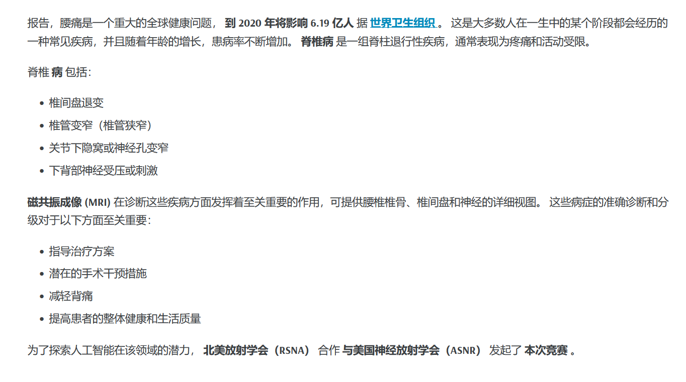
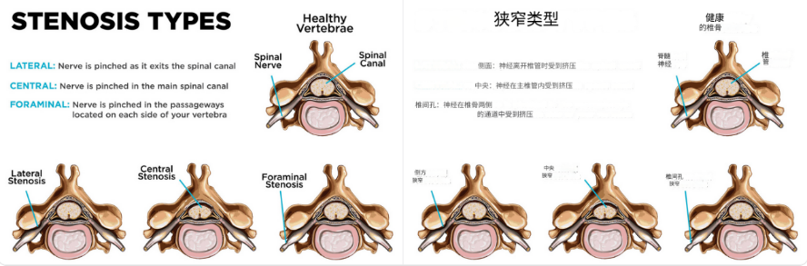
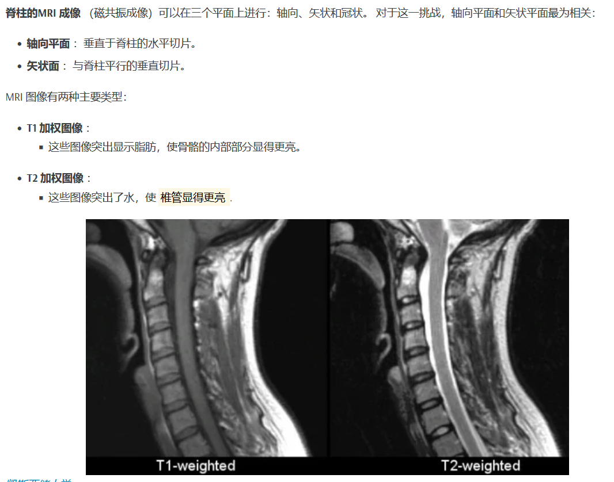
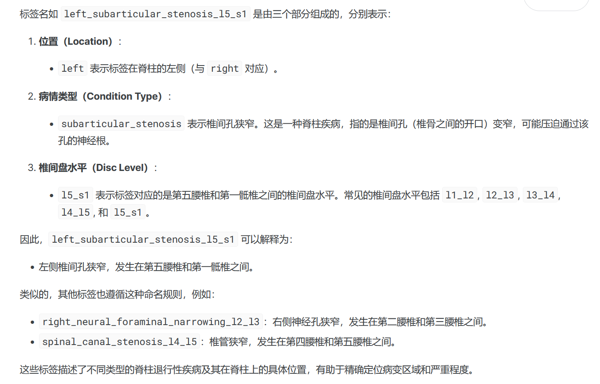
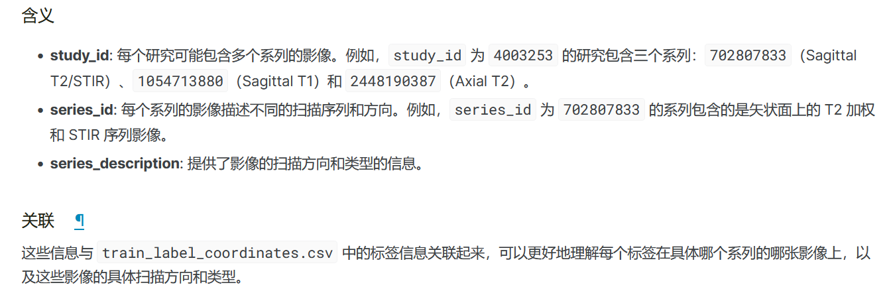

## 1.background


## 2.比赛描述

是本次竞赛的目标：创建可用于帮助检测与分类，评估脊柱退行性疾病，使用腰椎MR图像。参赛者将开发模型来模拟放射科医生诊断脊柱疾病的表现。 

#### 腰椎疾病类别  MRI图像
````
Left Neural Foraminal Narrowing       |    左侧神经孔狭窄
Right Neural Foraminal Narrowing      |    右侧神经孔狭窄
Left Subarticular Stenosis            |    左侧关节下狭窄
Right Subarticular Stenosis           |    右侧关节下狭窄
Spinal Canal Stenosis                 |    椎管狭窄 
````
#### 脊椎的五种水平，严重性分为3种评分：Normal/Mild, Moderate, or Severe（正常/轻度、中度或重度）
````
L1/L2
L2/L3
L3/L4
L4/L5
L5/S1
````
#### 脊柱


  


#### 神经


google翻译



### 详细描述
#### Foraminal narrowing 神经孔狭窄
椎间孔，脊神经通过的开口，可以变窄，这种情况最好在矢状面(平行于脊柱的垂直切片)上观察。
椎间孔狭窄导致神经受压，导致沿受影响神经分布的疼痛，这是神经在体内传播的路径。孔的缩小。

#### SUBARTICULAR STENOSIS 关节下狭窄


当关节下区（椎骨关节面正下方的区域）脊髓受压时就会发生。 这种情况在轴向平面（垂直于脊柱的水平切片）中最为明显。 该区域的压迫通常是由于导致椎间孔狭窄的类似因素造成的。 

##### Canal stenosis 椎管狭窄


 涉及椎管（脊髓穿过的通道）的撞击。 原因包括椎间盘突出、外伤、骨质增生（骨赘）和韧带增厚。 压缩程度通常在轴向平面上评估。 
#### MRI脊柱成像



### 数据文件说明
#### train.csv
包含训练集的标签。 每条记录包括：
- study_id （字符串）： 研究 ID。
  - 每个研究可能包括多个系列的图像。
- [condition]_[level] （字符串）：目标标签，例如...
  - spinal_canal_stenosis_l1_l2，严重程度为 Normal/Mild, Moderate，或者 Severe.
  - 有些条目的标签不完整。

#### train_label_coordinates.csv
提供标记区域的坐标。
- study_id （字符串,str）： 研究ID。
- series_id (str):       图像系列ID
- instance_number（int，整）：3D图像的堆栈里的序号
- condition ：状态，状态条件：
  - spinal_canal_stenosis：椎管狭窄
  - neural_foraminal_narrowing：神经孔狭窄，左右
  - subarticular_stenosis：关节下狭窄，左右
- level：病的水平：5种
- x：横坐标
- y：纵坐标

#### submission，提交的csv : 44036939
- row_id: 如：44036939_left_neural_foraminal_narrowing_l1_l2
  - 研究ID（第一层目录名）
  - 中间：条件（病的种类）
  - 水平l：5级
- normal_mild，moderate，moderate：三种严重程度



#### train_series_descriptions.csv 核磁共振的扫描位置



#### dcm数据格式
用于存储医学图像和相关元数据的标准格式，它可以追溯到1983年，可以用pydicom打开。